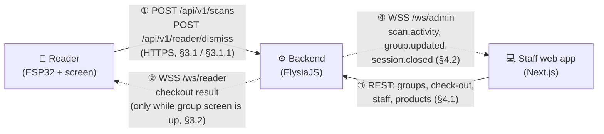
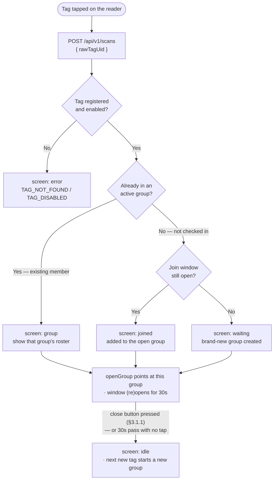
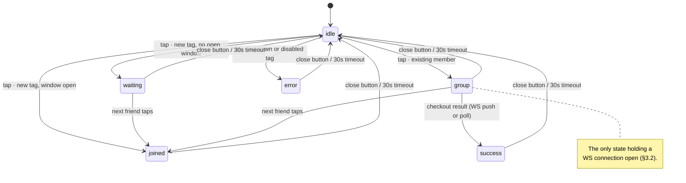
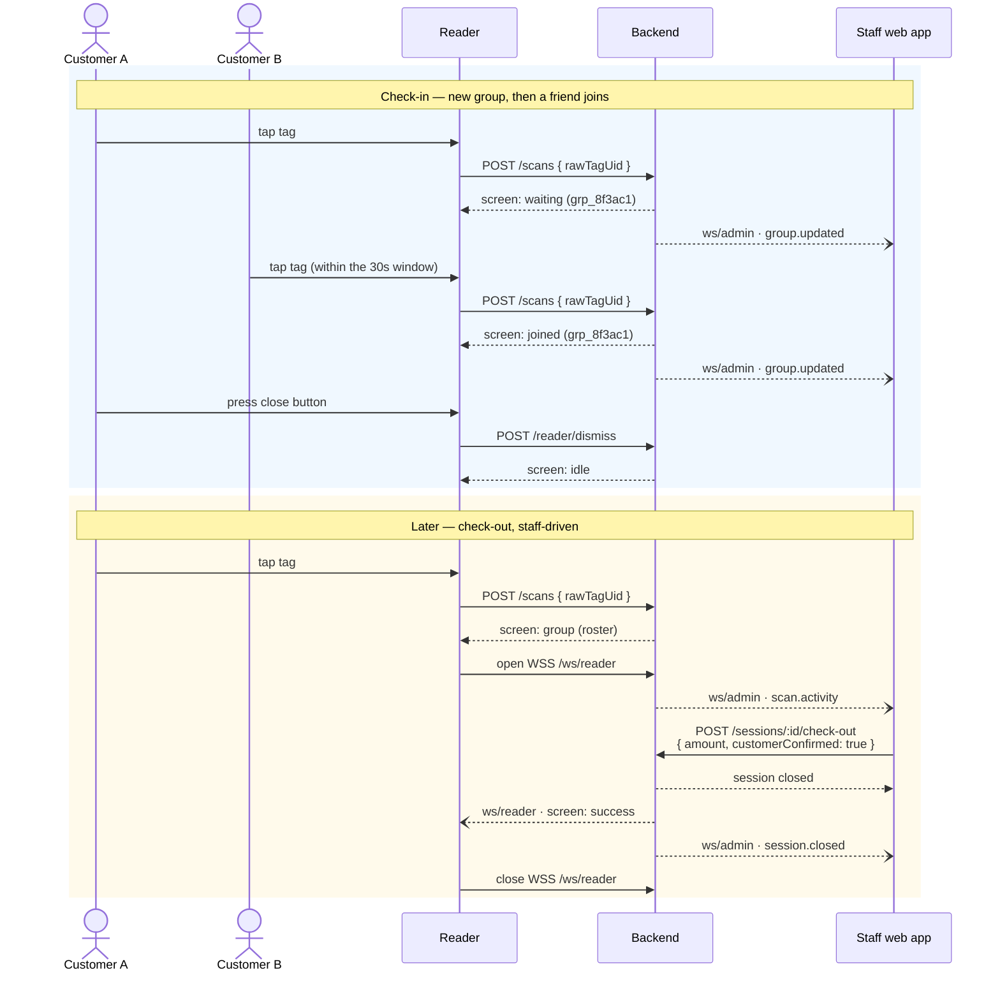

# API Communication Contract — Frontend / Backend / Hardware

[`api-convention.md`](./api-convention.md) defines the *style rules* (naming, envelopes, auth,
compliance behavior). This file is the concrete **wire contract**: the exact JSON/WebSocket messages
the three components — **Next.js frontend**, **ElysiaJS backend**, **ESP32 hardware** — must agree on
byte-for-byte, so any of them can be built or swapped independently as long as they honor this
contract. See [`structure.md`](./structure.md) for the component diagram this implements.

**One reader for the whole café.** There is a single physical NFC reader/screen unit, not one per
table. That rules out using the reader's identity to figure out "which table" a tap belongs to —
§3.1 below is built around that constraint, not around a per-table reader.

**Rules applied from [`rule.md`](./rule.md):** every message below that carries an NFC tag identifier
or session/billing data must travel over TLS (HTTPS/WSS only, never plain HTTP/WS) and must never
carry the raw physical NFC UID past the point where the backend resolves it to an internal ID (PDPA).
Every scan, check-in, check-out, and staff action message on this contract is also subject to the
audit-logging requirement in `api-convention.md` §8.2 (CCA §26) — that logging happens server-side and
is not part of the wire format itself.

All example values below (`grp_...`, `tag_...`, `sess_...`) are illustrative IDs, not a real ID
format spec — the backend can generate them however it likes as long as they're opaque strings.

---

## 1. Actors & transports

| Link | Transport | Who initiates |
|---|---|---|
| Hardware ↔ Backend | HTTPS (tap events) + WSS (scoped async push, only while the `group` screen is shown) | Hardware calls on tap; backend pushes checkout results |
| Frontend ↔ Backend | HTTPS (REST) + WSS (`/ws/admin`, live scanning indicator) | Frontend calls on demand; backend pushes admin events |
| Frontend ↔ Hardware | None — they never talk directly. All state flows through the backend. |

The reader authenticates as a device via the static `X-Device-Key` header
(`api-convention.md` §3) — since there's only one reader, no reader/table ID needs to travel in the
request body at all; the device key alone is enough to identify the caller.

Every message in this contract travels on one of four channels — this is the map for the rest of the
document:



Solid arrows are caller-initiated request/response; dotted arrows are backend-initiated pushes. Note
there is no arrow between the reader and the web app — they never talk directly.

## 2. Canonical data shapes

These object shapes are shared verbatim across every endpoint/event below — define them once
(e.g. as shared TypeScript types/Zod schemas importable by both the ElysiaJS backend and the Next.js
frontend) rather than redefining per-endpoint.

```ts
type Group = {
  groupId: string;
  status: "active" | "closed";
  startTime: string;      // ISO 8601 UTC
  tags: {
    tagId: string;        // internal UUID — never the raw NFC UID
    label: string | null; // optional display name/nickname, not full legal name
    checkInTime: string;  // ISO 8601 UTC
  }[];
};

type Session = {
  sessionId: string;
  tagId: string;
  groupId: string;
  checkInTime: string;
  checkOutTime: string | null;
  status: "open" | "closed";
};

type BillSummary = {
  amount: number;      // integer, minor currency unit (satang) — e.g. 4250 = ฿42.50
  ratePerHour: number;
};
```

Example of a real `Group` object, so the shape above isn't abstract:

```json
{
  "groupId": "grp_8f3ac1",
  "status": "active",
  "startTime": "2026-09-17T10:00:00Z",
  "tags": [
    { "tagId": "tag_4b21e0", "label": "Nutt", "checkInTime": "2026-09-17T10:00:00Z" },
    { "tagId": "tag_9c77f2", "label": null, "checkInTime": "2026-09-17T10:15:00Z" }
  ]
}
```

Neither `Group` nor `Session` carries a table identifier — there is no table concept anywhere in this
contract. See the PB-14 note in §4.2 for what that means for the admin view.

## 3. Hardware ⇄ Backend contract

The ESP32 has no session/group logic (`structure.md` §3) — it only sends a raw tap and renders
whatever screen state the backend tells it to render.

### 3.1 `POST /api/v1/scans` — every tap, no exceptions

**Request** — sent by the reader on every single tap, no matter what the tag turns out to be:

```json
{
  "rawTagUid": "04A3B2C1D4"
}
```

- `rawTagUid` is the physical tag's factory UID, read straight off the NFC chip.
- The backend resolves `rawTagUid` to an internal `tagId` on first lookup and **never returns
  `rawTagUid` in any response** (PDPA — see `api-convention.md` §7).
- Idempotent within a 2-second window per `rawTagUid` (`api-convention.md` §10) — a
  flaky-connection retry from firmware must not double-create a session.

#### How the backend decides "join" vs. "new group"

With one shared reader, location can't disambiguate which group a tap belongs to — so the backend
tracks a single, short-lived pointer instead, the **open group**: whichever group was most recently
touched, and until when that's still valid.

- **Any** non-error tap (whether it creates a group, joins one, or just re-displays one) sets
  `openGroup = { groupId, expiresAt: now + 30s }`.
- A **brand-new/unrecognized tag** taps in:
  - If `openGroup` hasn't expired → it joins `openGroup.groupId` → `screen: "joined"`.
  - Otherwise → it starts a **new** group → `screen: "waiting"`.
- An **already-checked-in tag** (belongs to an existing group) taps in → always shows that group's
  roster → `screen: "group"` — and this re-scan is itself what sets/refreshes `openGroup` to point at
  this group.
- The window closes **either** when the physical **close button** on the reader is pressed (§3.1.1)
  **or** when the 30 seconds elapse — whichever comes first. The button is the normal way to end it;
  the timeout is just the safety net for when nobody presses it (customer walks away mid-flow).

The whole decision, end to end:



This one rule covers both flows in `designdraft.md`: forming a group (§2.1) is just each new friend's
tap landing inside the window opened by the previous tap; joining a group that's already been playing
for a while (§2.2) just requires one current member to re-tap first (which reopens the window) before
the new person taps. Since there's only one physical reader, taps are naturally serialized — there's
no case of two people's re-scans racing each other.

**Response** — the `screen` field is the hardware's entire display vocabulary. Four cases:

**a) `waiting`** — this tap started a brand-new group (no open window was pending); the reader shows
"waiting for friends":

```json
{
  "data": {
    "screen": "waiting",
    "groupId": "grp_8f3ac1",
    "tagId": "tag_4b21e0"
  }
}
```

**b) `joined`** — this tap landed inside an open join window and was added to that group:

```json
{
  "data": {
    "screen": "joined",
    "groupId": "grp_8f3ac1",
    "tags": [
      { "tagId": "tag_4b21e0", "checkInTime": "2026-09-17T10:00:00Z" },
      { "tagId": "tag_9c77f2", "checkInTime": "2026-09-17T10:15:00Z" }
    ]
  }
}
```

**c) `group`** — a tag already in the group was scanned again; show the roster and (re)open the join
window. This is also the gateway into staff-driven check-out (§3.2):

```json
{
  "data": {
    "screen": "group",
    "groupId": "grp_8f3ac1",
    "tags": [
      { "tagId": "tag_4b21e0", "checkInTime": "2026-09-17T10:00:00Z" },
      { "tagId": "tag_9c77f2", "checkInTime": "2026-09-17T10:15:00Z" }
    ]
  }
}
```

**d) `error`** — unregistered or disabled tag:

```json
{
  "error": {
    "code": "TAG_DISABLED",
    "message": "This card has been disabled"
  }
}
```

The `screen` enum is the hardware's entire UI vocabulary — the full set across every transport is
`idle` / `waiting` / `joined` / `group` / `success` / `error` (`success` arrives via the push channel
in §3.2; `idle` via the close button in §3.1.1). Adding a new hardware-visible state means adding a
new enum value here first, then implementing it in firmware. Don't have the backend send free-form
text the firmware is expected to just print; keep firmware dumb and enum-driven.

### 3.1.1 `POST /api/v1/reader/dismiss` — the close button

Waiting out the 30-second timeout before the next party can start a fresh group is dead time at a
single shared reader. The reader has a physical **close button** that ends the current display
immediately: it clears `openGroup` server-side, so the very next unrecognized tag starts a **new**
group instead of joining the one that was just on screen.

**Request** — no body needed; the `X-Device-Key` header identifies the caller:

```json
POST /api/v1/reader/dismiss
{}
```

**Response:**

```json
{
  "data": {
    "screen": "idle"
  }
}
```

- The button works from **any** screen (`waiting`, `joined`, `group`, `success`, `error`) — one rule
  for firmware: press = clear everything, go back to `idle`.
- On returning to `idle` the reader also closes its WS connection if one is open (§3.2).
- This is *not* an audit-logged action (`api-convention.md` §8.2): it only clears ephemeral display
  state and never touches a session, group membership, or bill. Nobody is checked in or out by
  pressing it.
- If the request fails (Wi-Fi drop), firmware should retry once, then return to `idle` locally
  anyway — the 30-second server-side timeout still clears `openGroup`, so a lost dismiss degrades to
  the old timeout behavior rather than breaking anything.

The button also shrinks the edge case where re-scanning to open the roster for **staff-driven
check-out** (§3.2) leaves the join window open as a side effect: staff press close as soon as the
roster has served its purpose, instead of leaving a 30-second gap in which a stranger's unregistered
tag could tap in and be added to the group being checked out.

### 3.2 `WSS /ws/reader` — async push to the reader

Check-out (`api-convention.md` §4.1) is triggered from the **staff web app**, not from the reader
that's mid-display. The reader that showed the `group` screen needs to be told the outcome
asynchronously — but it does **not** hold this connection open all the time. An always-on WS
connection would mean the ESP32 keeps a live authenticated socket open for its entire operating day,
for a payoff that only matters in the brief window between showing the roster and staff acting on it.
Instead, the connection is **scoped to the `group` screen only**:

- **Idle / `waiting` / `joined` screens:** no WS connection. Those states are always driven directly
  by the synchronous response to the reader's own `POST /api/v1/scans` call (§3.1) — there's nothing
  to push, since the next tap is what changes them.
- **On entering the `group` screen:** the reader opens `WSS /ws/reader`. This is the one state where
  an external actor (staff, on the web app) can change things without the reader making another
  call — the reader can't predict whether or when that will happen, so it listens live for exactly
  this window.
- **Closing the connection:** the reader closes the socket on whichever comes first — the **close
  button** being pressed (§3.1.1), a terminal result arriving (see below), or the display timeout
  elapsing with no staff action (e.g. the customer walks away without paying).
- **If the connection can't be opened or drops** (ESP32 Wi-Fi drops are expected, not exceptional)
  while the `group` screen is still showing, the reader falls back to polling
  `GET /api/v1/reader/state` every few seconds for the remainder of that window. Firmware must
  implement both paths.

Messages on this channel reuse the exact same `{ "data": { "screen": ... } }` shape as the
`POST /api/v1/scans` response (§3.1) — no `event` wrapper. Firmware only ever needs one rule: whatever
transport a message arrives on, read `data.screen` to know what to render. (Contrast this with
`/ws/admin` in §4.2, which carries several distinct event types and does need an `event` field to tell
them apart.)

**Whole group paid and checked out** — reader shows a success/thank-you screen with the total:

```json
{
  "data": {
    "screen": "success",
    "bill": { "amount": 8500, "ratePerHour": 3000 }
  }
}
```

**One member of the group checked out individually** — reader stays on the group screen minus that
tag:

```json
{
  "data": {
    "screen": "success",
    "tagRemoved": "tag_4b21e0"
  }
}
```

### 3.3 Reader screen state machine

The same contract from the firmware's point of view — every state it can be in, and what moves it:



The diagram shows the meaningful paths; the general rule is that a tap in **any** state just re-runs
the §3.1 decision and lands on whichever screen it produces. Everything returns to `idle` on the close
button or the timeout, so firmware never needs to track more than "what am I showing right now."

### 3.4 Firmware compatibility rule

ESP32 devices in the field can't always be re-flashed immediately. Within a major version
(`/api/v1`), the backend must only **add** optional fields/enum values, never remove or repurpose an
existing `screen` value or rename a field firmware already parses. A breaking change to this contract
requires `/api/v2` and a firmware update rollout plan, not a silent change to `v1`.

## 4. Frontend ⇄ Backend contract

### 4.1 REST — endpoint catalog

Full request/response bodies follow the envelope/field rules in `api-convention.md` §§6–7. This is
the map of what exists; see that file for the shared error/pagination rules.

| Method & path | Purpose | Backlog |
|---|---|---|
| `POST /api/v1/auth/staff/login` | Staff sign-in | — |
| `GET /api/v1/groups?status=active` | Active groups for the floor view (no table mapping — see PB-14 note below) | PB-04, PB-14 |
| `GET /api/v1/groups/:groupId` | One group + its checked-in tags | PB-04 |
| `POST /api/v1/sessions/:sessionId/check-out` | Individual check-out | PB-02, PB-12 |
| `POST /api/v1/groups/:groupId/check-out` | Whole-group check-out | PB-02, PB-13 |
| `GET /api/v1/staff`, `POST/PATCH/DELETE /api/v1/staff/:id` | Staff account management | PB-15 |
| `POST /api/v1/nfc-tags`, `PATCH /api/v1/nfc-tags/:tagId`, `POST /api/v1/nfc-tags/:tagId/disable` | Customer NFC identity management | PB-15 |
| `GET /api/v1/products`, `GET /api/v1/products/:productId` | 3D-printed product catalog | PB-08, PB-09, PB-10 |
| `GET /api/v1/audit-logs` | Compliance log viewer (staff/admin only) | rule.md CCA §26 |

Example — individual check-out request/response, spelled out in full:

Request:

```json
POST /api/v1/sessions/sess_7a01d4/check-out
{
  "staffId": "staff_002",
  "amount": 4250,
  "customerConfirmed": true
}
```

Response:

```json
{
  "data": {
    "sessionId": "sess_7a01d4",
    "status": "closed"
  }
}
```

`customerConfirmed` must be present and `true` — the backend rejects the request otherwise
(`api-convention.md` §8.5, ETA §9).

### 4.2 `WSS /ws/admin` — live scanning indicator (PB-14)

One connection per staff session, filtered server-side to what that staff member's role can see.
Three event types, each with a full example:

**`scan.activity`** — fires the instant a tap resolves, so staff see who's scanning in real time:

```json
{
  "event": "scan.activity",
  "data": {
    "groupId": "grp_8f3ac1",
    "scanningTagId": "tag_4b21e0"
  },
  "ts": "2026-09-17T10:42:00Z"
}
```

**`group.updated`** — fires whenever a `Group` object changes (new member, member removed, closed).
`data` is a full `Group` object as defined in §2, e.g.:

```json
{
  "event": "group.updated",
  "data": {
    "groupId": "grp_8f3ac1",
    "status": "active",
    "startTime": "2026-09-17T10:00:00Z",
    "tags": [
      { "tagId": "tag_4b21e0", "label": "Nutt", "checkInTime": "2026-09-17T10:00:00Z" },
      { "tagId": "tag_9c77f2", "label": null, "checkInTime": "2026-09-17T10:15:00Z" }
    ]
  },
  "ts": "2026-09-17T10:15:00Z"
}
```

**`session.closed`** — fires once a session ends, individually or as part of a group check-out:

```json
{
  "event": "session.closed",
  "data": {
    "sessionId": "sess_7a01d4",
    "groupId": "grp_8f3ac1"
  },
  "ts": "2026-09-17T10:45:00Z"
}
```

> **PB-14 gap:** `PB-14` reads "show which **table** is currently being scanned." With a single
> shared reader and no `tableId` anywhere in this contract, the backend has no way to know which
> physical table a group is sitting at — it only knows which group/tags are active. Two ways to close
> this gap, neither implemented yet: (a) redefine `PB-14` around group/tag identity only (staff
> recognize the customer by name/tag label, not a table number), or (b) add a manually-entered table
> label that staff attach to a group from the admin UI (a UI/data field, never derived from hardware).
> Pick one before building the admin floor view — don't leave it implicit.

## 5. Shared error vocabulary

Error `code`s are the same list in `api-convention.md` §11 regardless of which component receives
them. Since the ESP32 has no rich UI, it needs a fixed short-string mapping instead of rendering
`message` directly:

| `code` | Hardware display text |
|---|---|
| `TAG_NOT_FOUND` | "Unknown card — see staff" |
| `TAG_DISABLED` | "Card disabled — see staff" |
| `TAG_ALREADY_IN_GROUP` | (not an error — resolves to `screen: "group"`) |
| `CONFIRMATION_REQUIRED` | Not hardware-facing — only returned to the staff web app |

Keep this table in sync with §11 of `api-convention.md`: every hardware-reachable error code needs an
entry here, and every entry here needs a matching code there.

## 6. Sequence walkthroughs

These are the exact wire messages for the two flows already diagrammed in `designdraft.md` §4.3, with
every message shown in full (no `...` shorthand) so each step can be read on its own. Both assume the
single shared reader from §1.

One full visit — check in, a friend joins, then check out — across all three components:



Note what the reader never does: it never calls a check-out endpoint, and it never holds a WS
connection outside the `group` screen.

### 6.1 Group check-in, then a later friend joins

**Step 1 — Customer A taps in. No join window was open, so this starts a new group:**

```
POST /api/v1/scans
{ "rawTagUid": "04A3B2C1D4" }

→ { "data": { "screen": "waiting", "groupId": "grp_8f3ac1", "tagId": "tag_4b21e0" } }
```

This tap also opens the join window: `openGroup = { groupId: "grp_8f3ac1", expiresAt: +30s }`.

**Step 2a — a friend taps within that 30-second window → joins automatically:**

```
POST /api/v1/scans
{ "rawTagUid": "9F1C7A20E3" }

→ {
     "data": {
       "screen": "joined",
       "groupId": "grp_8f3ac1",
       "tags": [
         { "tagId": "tag_4b21e0", "checkInTime": "2026-09-17T10:00:00Z" },
         { "tagId": "tag_9c77f2", "checkInTime": "2026-09-17T10:15:00Z" }
       ]
     }
   }
```

**Step 2b — instead, imagine the window had already expired (group's been playing for a while) and a
friend arrives later.** Customer A must re-tap first to reopen the window:

```
POST /api/v1/scans
{ "rawTagUid": "04A3B2C1D4" }

→ { "data": { "screen": "group", "groupId": "grp_8f3ac1", "tags": [ ... ] } }
```

...then the friend taps within the newly-opened window and gets the same `"joined"` response as 2a.

**Step 3 — the backend also pushes the updated group to the admin dashboard:**

```
WSS /ws/admin
{ "event": "group.updated", "data": { "groupId": "grp_8f3ac1", "status": "active", ... }, "ts": "2026-09-17T10:15:00Z" }
```

**Step 4 — the group is complete, so someone presses the close button.** The next party doesn't have
to wait out the timeout — their first tap starts a new group immediately:

```
POST /api/v1/reader/dismiss
{}

→ { "data": { "screen": "idle" } }
```

### 6.2 Individual check-out

**Step 1 — Customer A taps to open the group screen and signal intent to pay:**

```
POST /api/v1/scans
{ "rawTagUid": "04A3B2C1D4" }

→ { "data": { "screen": "group", "groupId": "grp_8f3ac1", "tags": [ ... ] } }
```

The backend also pushes to the admin dashboard so staff see who's scanning:

```
WSS /ws/admin
{ "event": "scan.activity", "data": { "groupId": "grp_8f3ac1", "scanningTagId": "tag_4b21e0" }, "ts": "2026-09-17T10:42:00Z" }
```

**Step 2 — staff confirm payment and trigger check-out from the admin web app:**

```
POST /api/v1/sessions/sess_7a01d4/check-out
{ "staffId": "staff_002", "amount": 4250, "customerConfirmed": true }

→ { "data": { "sessionId": "sess_7a01d4", "status": "closed" } }
```

**Step 3 — the backend notifies both the admin dashboard and the physical reader:**

```
WSS /ws/admin
{ "event": "session.closed", "data": { "sessionId": "sess_7a01d4", "groupId": "grp_8f3ac1" }, "ts": "2026-09-17T10:45:00Z" }

WSS /ws/reader
{ "data": { "screen": "success", "tagRemoved": "tag_4b21e0" } }
```

## 7. Traceability

| Contract area | Backlog item(s) |
|---|---|
| Scan contract & join-window rule (§3.1) | PB-01, PB-11 |
| Reader push channel (§3.2) | PB-02, PB-12, PB-13 |
| Admin WebSocket (§4.2) — table-mapping gap noted | PB-14 |
| REST catalog (§4.1) | PB-02–PB-04, PB-08–PB-10, PB-12, PB-13, PB-15 |
