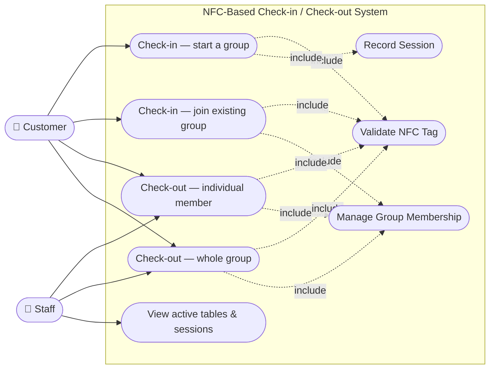
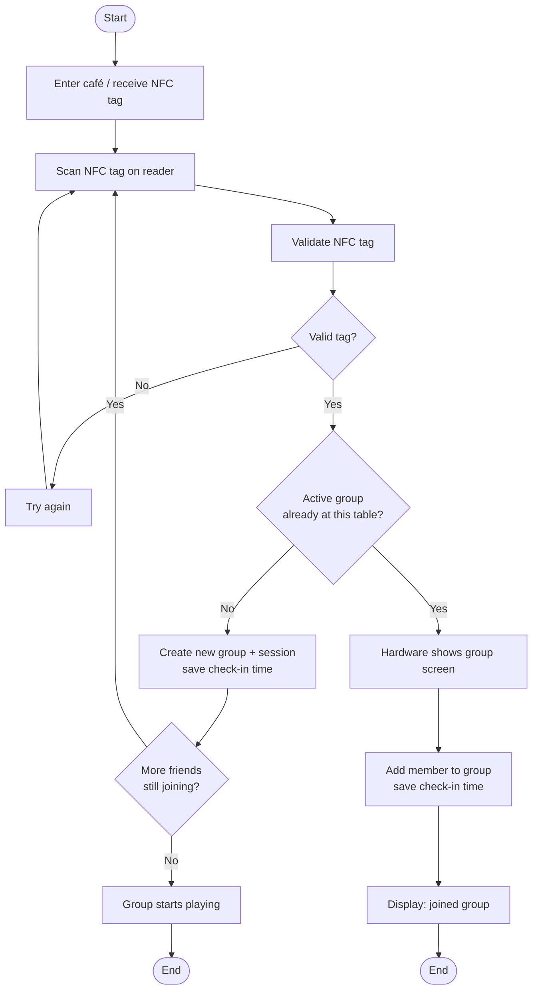
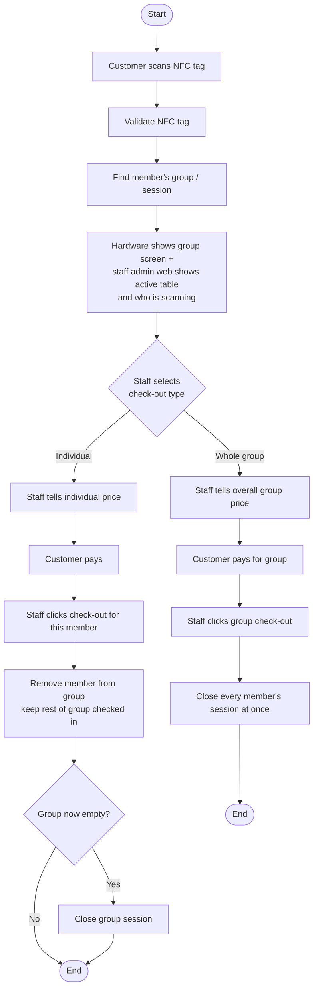
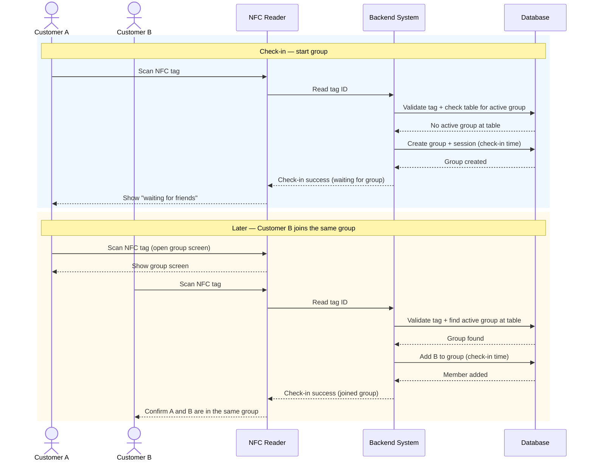
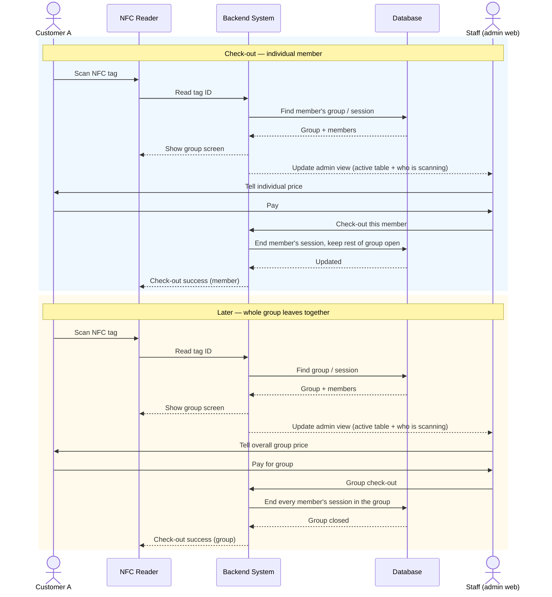
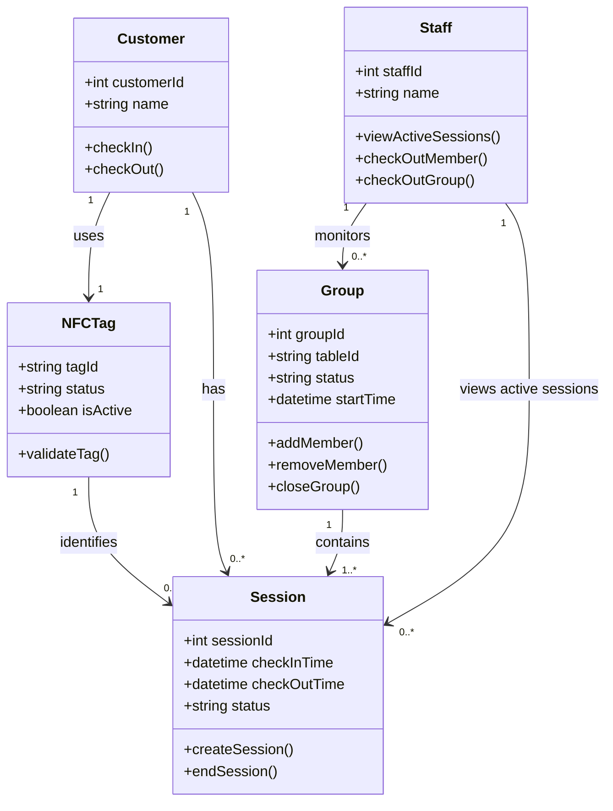

# Design Draft

## 1. Feature List

- NFC Check-in (individual and group)
- NFC Check-out (individual and group)
- Group Formation (customers can join an existing checked-in group)
- Session Tracking
- Active Customer Monitoring (staff web view of who is currently scanning, per table)
- 3D-Printed Product Display

## 2. User Journey

### 2.1 Check-in — solo customer, group forms upfront

1. Customer A enters the café and receives an NFC tag.
2. Customer A scans the tag to check in.
3. The group waits until every friend has scanned in.
4. Once everyone has checked in, the group starts playing.

### 2.2 Check-in — customer joins a group already playing

1. Customer A enters the café, receives an NFC tag, scans in, and starts playing.
2. Customer B arrives later and wants to join Customer A's table.
3. Customer A scans their tag again; the hardware reader shows the group screen.
4. Customer B receives an NFC tag and scans it on the same reader.
5. Customer A and Customer B are now in the same group/session.

### 2.3 Check-out — individual

1. Customer A scans their NFC tag. The hardware shows the group screen, and the staff admin web
   view shows which table is currently scanning, with an indicator for who is scanning.
2. Staff tell Customer A their individual price.
3. Customer A pays.
4. Staff click check-out to remove Customer A's NFC tag from the system (the rest of the group is
   unaffected).

### 2.4 Check-out — whole group

1. Customer A scans their NFC tag. The hardware shows the group screen, and the staff admin web
   view shows which table is currently scanning, with an indicator for who is scanning.
2. Staff tell Customer A the overall group price.
3. Customer A pays for the whole group.
4. Staff click group check-out to close out every member of the group at once.

## 3. Prototype

[[prototype NFC Check-in Check-out](https://nfc-boardgame-checkin-demo.netlify.app/?fbclid=IwY2xjawUGCo1wZG9mBWV4dG4DYWVtAjEwAGJyaWQRMU9JbXFLWUxEbDV4MTNPRHhzcnRjBmFwcF9pZBAyMjIwMzkxNzg4MjAwODkyAAEeNbLfcFvwOo2do7Y8ZKLrcExei3-XCwiltjQm9_psq-KJT9H-AY3W85_QBK0_aem_e89gmUppKcviwS1fkkfMcw)]

## 4. Diagrams

> Diagrams are plain-text [Mermaid](https://mermaid.js.org/) so they can be edited directly in this
> file (GitHub renders them inline). No image files to regenerate.

### 4.1 Use Case Diagram

### 4.2 Activity Diagram

**Check-in** (solo start, or joining a group already playing):

**Check-out** (staff-assisted, individual or whole group):

### 4.3 Sequence Diagram

**Check-in — group forms before playing, then a later friend joins:**

**Check-out — individual member, then whole group:**

### 4.4 Class Diagram

