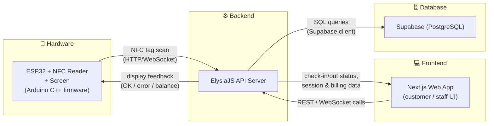

# System Structure

High-level architecture of the NFC Boardgame Café Check-in/Check-out system, split into four parts: **Frontend**, **Backend**, **Hardware**, and **Database**.

## Diagram

## Components

### 1. Frontend — Next.js
- Web app used by customers and staff (dashboard, session history, product display for 3D-printed items).
- Staff admin view shows which table currently has an active scan in progress, with an indicator for
  which group member is scanning, so staff can confirm the right person before charging.
- Talks to the backend over REST/WebSocket to fetch check-in status, sessions, groups, and bills.
- Previously the old system served frontend and backend from a single server; the frontend is now a
  separate Next.js app that only talks to the backend over the API — it has no direct database access.

### 2. Backend — ElysiaJS
- Central API server that all other parts talk to.
- Receives NFC scan events from the ESP32 hardware, validates the tag, and starts/stops a session.
- Owns group logic: creating a group on first check-in, adding a member when a tag is scanned at a
  table with an active session, and closing out one member (individual check-out) or the whole group
  (group check-out) on staff request.
- Exposes a **user-management API** (separate from the check-in/checkout session logic) for creating,
  updating, and deactivating staff accounts and customer NFC identities.
- Serves data to the Next.js frontend and persists/reads state from the database.

### 3. Hardware — ESP32 + Screen (Arduino)
- ESP32 microcontroller with an NFC reader module and a small screen, programmed with Arduino-style C++ firmware.
- Acts purely as a scanning interface: on each tag tap it sends the scanned UUID to the backend and
  displays whatever the backend returns (success, error, balance, or the group screen listing current
  group members) — it holds no session or group logic itself.

### 4. Database — Supabase (PostgreSQL)
- Stores users/cards, check-in/check-out sessions, billing records, and product info.
- Accessed only by the backend via the Supabase client/SQL, keeping the database out of direct reach of the frontend and hardware.

## Data Flow Summary

1. Customer taps their NFC card on the **ESP32** reader.
2. **ESP32** sends the tag UUID to the **ElysiaJS backend**.
3. Backend looks up/updates the session in **Supabase (Postgres)**.
4. Backend returns a result to the **ESP32** (shown on its screen) and updates data available to the **Next.js frontend**.
